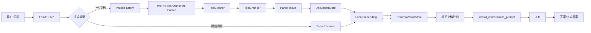

# 文档智能问答平台

这是一个可在本机直接演示的文档问答项目。它基于 FastAPI 实现 RAG（检索增强生成）链路：上传文档、解析与分块、建立本地知识库、检索相关内容，并根据检索结果生成回答。

项目默认以本地演示模式运行：不需要填写第三方模型密钥，也不会主动请求外部服务。双击根目录的 `启动.command` 即可同时启动前端和后端。详细的安装、启动、关闭、使用和配置说明见 [README_LOCAL.md](README_LOCAL.md)。

## 主要能力

- 上传 Markdown、HTML、DOCX、PDF 等文档并建立知识集合。
- 对文档内容进行清洗、分块、向量化和相似度检索。
- 基于检索片段进行普通问答或流式问答，并返回参考来源。
- 在演示模式下使用本地向量与本地回答，便于离线展示完整流程。
- 支持通过环境变量接入兼容接口的真实模型；密钥仅保存在本机 `.env` 文件中。

## 项目说明

项目的核心思想是：**把文档知识先转换成可检索的向量；用户提问时，先从知识库找相关片段，再把片段交给大模型生成答案。** 大模型本身不直接“记住”上传的文档，而是依赖检索到的上下文回答。

## 1. 项目整体架构



系统可以分成五层：

| 层次 | 目录 | 主要职责 |
| --- | --- | --- |
| API 层 | `src/api` | 接收 HTTP 请求、参数校验、组装服务、返回结果 |
| 解析层 | `src/parsers` | 识别文件类型，提取文本和表格，清洗并分块 |
| 向量层 | `src/embeddings` | 把文本转换为向量，并持久化到 ChromaDB |
| 检索层 | `src/retrieval`、`src/database` | 根据问题检索最相关的文档块 |
| 生成层 | `src/llm` | 组织上下文和提示词，调用大模型生成答案 |

## 2. 两条核心业务链路

### 2.1 文档入库链路

调用 `POST /api/document/upload` 时，主要经过以下步骤：

```text
upload_document()
  ├─ 读取文件字节流
  ├─ 校验文件大小和扩展名
  ├─ _save_file_with_hash()       # 用 SHA-256 前 16 位去重保存
  ├─ ParserFactory.get_parser()   # 根据扩展名选择解析器
  ├─ parser.parse_from_bytes()
  │    ├─ 提取原始文本/表格
  │    ├─ TextCleaner.clean()
  │    ├─ TableProcessor.merge_tables()
  │    └─ TextChunker.split()
  ├─ DocumentStore.add_parse_result()
  │    ├─ 为每个 chunk 创建 Document
  │    ├─ LocalEmbedding.embed_batch()
  │    └─ ChromaVectorStore.add_documents()
  └─ 返回入库数量和重复文件标记
```

关键对象是 `ParseResult`，它统一了各种文件解析器的输出格式：

```python
ParseResult(
    filename, total_pages, total_chunks, table_count,
    chunks, raw_text, tables, metadata
)
```

不同格式的解析器只负责“如何提取内容”，后续的清洗、分块、向量化流程保持一致，这就是解析器抽象和工厂模式的价值。

### 2.2 问答链路

调用 `POST /api/chat/` 时，主要经过以下步骤：

```text
chat(request)
  ├─ get_llm()                         # 创建智谱或通义千问客户端
  ├─ get_search_service(collection_name)
  │    ├─ get_embedding_model()        # lru_cache，只加载一次本地模型
  │    ├─ DocumentStore()
  │    └─ SearchService()
  ├─ RetrievalConfig(top_k=3)
  ├─ SearchService.search()
  │    └─ DocumentStore.search()
  │         ├─ embedding.embed_text(query)
  │         ├─ ChromaVectorStore.search()
  │         └─ 返回相似度分数和文档片段
  ├─ generate_answer()
  │    ├─ format_context()            # 去重并限制上下文长度
  │    ├─ build_prompt()              # 组装问题和上下文
  │    └─ LLM.generate()              # 调用 OpenAI 兼容接口
  └─ 返回 answer、sources、token_used、耗时
```

流式接口 `POST /api/chat/stream` 与普通接口共享“检索和提示词”流程，只把最后的 `generate_answer()` 换成 `generate_answer_stream()`，通过 `StreamingResponse` 逐段返回模型输出。

## 3. 目录和模块说明

```text
rag_project/
├── src/
│   ├── api/
│   │   ├── main.py                 # 创建 FastAPI 应用并注册路由
│   │   ├── config.py               # 环境变量和系统配置
│   │   ├── deps.py                 # Embedding、检索服务、LLM 的创建入口
│   │   ├── models.py               # ChatRequest、ChatResponse
│   │   └── routers/
│   │       ├── document.py         # 文档上传、按路径解析、格式查询
│   │       ├── chat.py             # 普通问答和流式问答
│   │       └── health.py           # 健康检查
│   ├── parsers/
│   │   ├── base.py                 # BaseParser、ParseResult
│   │   ├── __init__.py             # ParserFactory、parse_file
│   │   ├── pdf_parse.py            # PDF + OCR + 表格解析
│   │   ├── word_parser.py          # DOCX 段落和表格解析
│   │   ├── markdown_parser.py      # Markdown 解析
│   │   ├── html_parser.py          # HTML 转 Markdown 后解析
│   │   ├── cleaner.py              # 页码、分隔线等噪声清理
│   │   ├── chunker.py              # 段落、句子、字符分块
│   │   └── table_parser.py         # Markdown 表格和 DataFrame 转换
│   ├── embeddings/
│   │   ├── base.py                 # Embedding 抽象接口
│   │   ├── local_embedding.py      # sentence-transformers 本地模型
│   │   ├── openai_embedding.py     # OpenAI 兼容 Embedding 接口
│   │   ├── vector_store.py         # Document、SearchResult、向量库接口
│   │   └── chroma_store.py         # ChromaDB 持久化实现
│   ├── database/
│   │   └── document_store.py       # 文本与向量之间的业务封装
│   ├── retrieval/
│   │   └── search_service.py       # 检索配置、分数过滤、TTL 缓存
│   └── llm/
│       ├── llm.py                  # OpenAI 兼容的同步/异步 LLM 客户端
│       └── rag.py                  # 上下文、Prompt、答案生成
├── frontend/                       # Vue 3 + Element Plus CDN 前端
├── data/uploads/                   # 上传文件
├── data/chroma_db/                 # ChromaDB 本地数据
├── models/cache/                   # 本地 Embedding 模型缓存
├── tests/                          # 各模块测试和示例
├── pyproject.toml                  # 项目依赖和 uv 配置
└── uv.lock                         # 锁定后的依赖版本
```

## 4. 关键函数职责

### API 和依赖管理

- `src.api.main:app`：创建应用，注册 `/api/document`、`/api/chat`、`/api/health` 路由。
- `get_embedding_model()`：创建本地 `LocalEmbedding`，通过 `lru_cache` 避免每次请求重新加载模型。
- `get_search_service(collection_name)`：为指定 Chroma collection 组装 `DocumentStore` 和 `SearchService`。
- `get_llm(model)`：根据 `zhipu` 或 `qwen` 配置创建统一的 `LLM` 对象。

### 文档解析

- `ParserFactory.get_parser(file_path)`：按后缀返回具体解析器。
- `parse_file(file_path)`：对本地文件执行“选择解析器 + 解析”。
- `BaseParser.parse()` / `parse_from_bytes()`：统一文件路径和上传字节流两种入口。
- `TextCleaner.clean()`：删除空行、页码、分隔线等常见噪声。
- `TextChunker.split()`：按段落、句子或字符切分，并可附加表格块。
- `TableProcessor.merge_tables()`：尝试合并跨页表格。

### 向量和检索

- `DocumentStore.add_parse_result()`：把 `ParseResult.chunks` 转成 `Document`，批量生成向量并入库。
- `DocumentStore.search()`：向量化问题，调用向量库查询，再统一整理结果格式。
- `ChromaVectorStore.add_documents()`：写入文本、Embedding、ID 和 metadata。
- `ChromaVectorStore.search()`：使用 Chroma 的 cosine 距离查询，并转换成相似度 `1 - distance`。
- `SearchService.search()`：应用 `top_k`、`min_score` 和 namespace 过滤，记录检索耗时。

### RAG 生成

- `format_context()`：去掉重复片段，并限制上下文字符数。
- `build_prompt()`：要求模型严格依据上下文回答，不知道时回答“我不知道”。
- `LLM.generate()`：同步调用 OpenAI 兼容的 chat completions 接口。
- `LLM.generate_stream()`：异步流式调用模型。
- `generate_answer()` / `generate_answer_stream()`：连接检索结果和 LLM，形成完整 RAG 生成流程。

## 5. 数据是怎样流动的

一条入库数据在系统中的形态大致如下：

```text
文件
  → 原始文本 raw_text
  → 清洗后的文本
  → chunks: [{content, index, length, type, ...}]
  → Document(id, content, metadata)
  → embedding: List[float]
  → Chroma collection
```

查询结果的统一形态大致如下：

```python
{
    "id": "default_demo.md_0",
    "content": "与问题相关的文档片段",
    "metadata": {
        "filename": "demo.md",
        "chunk_index": 0,
        "chunk_type": "text",
        "namespace": "default"
    },
    "score": 0.82
}
```

其中 `collection_name` 是 Chroma 的集合名；`namespace` 是写入 metadata 的逻辑隔离字段。当前聊天接口主要通过 collection name 隔离知识库，`RetrievalConfig.namespace` 已预留给更细粒度过滤。

## 6. 环境配置

在项目根目录创建 `.env`：

```dotenv
# 必填其一：根据 DEFAULT_MODEL 选择对应服务商
ZHIPU_API_KEY=your_zhipu_api_key
DASHSCOPE_API_KEY=your_dashscope_api_key
DEFAULT_MODEL=zhipu

# 可选：模型和接口地址
ZHIPU_MODEL=glm-4-flash
DASHSCOPE_MODEL=qwen-plus
ZHIPU_BASE_URL=https://open.bigmodel.cn/api/paas/v4
DASHSCOPE_BASE_URL=https://dashscope.aliyuncs.com/compatible-mode/v1

# 可选：Embedding
EMBEDDING_MODEL=BAAI/bge-small-zh-v1.5
EMBEDDING_DEVICE=cpu
EMBEDDING_CACHE_DIR=./models/cache

# 可选：数据和检索
CHROMA_DB_PATH=./data/chroma_db
SEARCH_TOP_K=3
ENABLE_SEARCH_CACHE=false
SEARCH_CACHE_TTL=300
SEARCH_CACHE_MAXSIZE=100
```

本地 Embedding 模型首次使用时可能需要下载；项目已提供 `models/cache`，也可以通过 `EMBEDDING_CACHE_DIR` 指定其他目录。CPU 适合学习和小数据量测试，数据量较大时可将 `EMBEDDING_DEVICE` 改为 `cuda`，前提是本机具备匹配的 CUDA/PyTorch 环境。

## 7. 安装和启动

```bash
cd /Users/erpan/Desktop/学习之路/企业级RAG项目/代码/rag_project

# 安装 uv 后同步依赖
uv sync

# 启动开发服务
uv run uvicorn src.api.main:app --reload --port 8000
```

启动后可以访问：

- 前端：`http://localhost:8000`（当前根路径返回简单的 Hello World；前端也可直接打开 `frontend/index.html`）
- Swagger：`http://localhost:8000/docs`
- ReDoc：`http://localhost:8000/redoc`
- 健康检查：`http://localhost:8000/api/health/`

## 8. API 使用示例

上传文档并写入名为 `demo` 的集合：

```bash
curl -X POST http://localhost:8000/api/document/upload \
  -F "file=@data/test.html" \
  -F "collection_name=demo"
```

普通问答：

```bash
curl -X POST http://localhost:8000/api/chat/ \
  -H "Content-Type: application/json" \
  -d '{
    "query": "这个文档主要讲了什么？",
    "collection_name": "demo",
    "model": "zhipu"
  }'
```

流式问答：

```bash
curl -N -X POST http://localhost:8000/api/chat/stream \
  -H "Content-Type: application/json" \
  -d '{
    "query": "这个文档主要讲了什么？",
    "collection_name": "demo",
    "model": "zhipu"
  }'
```

## 9. 建议的学习顺序

1. 先读 `src/api/routers/document.py`，理解上传请求如何进入系统。
2. 再读 `src/parsers/__init__.py`、`base.py` 和任意一个具体 Parser，理解工厂模式和统一返回值。
3. 重点跟读 `cleaner.py` 与 `chunker.py`，观察“原始文本为什么要清洗、为什么要分块”。
4. 阅读 `document_store.py`，理解文本、metadata、Embedding、向量库之间的关系。
5. 阅读 `chroma_store.py` 和 `search_service.py`，理解向量查询、距离分数、top-k 和缓存。
6. 最后阅读 `llm/rag.py`、`llm/llm.py` 和 `chat.py`，理解检索结果如何进入 Prompt 并生成答案。
7. 用 `tests/` 中的测试单独验证每个模块，再通过 API 串起完整流程。

## 10. 当前实现中的学习注意点

- `DocumentStore.add_parse_result()` 使用 `namespace + filename + chunk_index` 生成 ID；同一个 collection 中重复写入相同文件时可能产生 ID 冲突，因此上传接口通过文件哈希做了重复文件跳过。
- `TextCleaner.full_clean()` 中的 `remove_extra_chars()` 会删除中文、英文、数字之外的大量字符，实际生产使用前要谨慎；它可能破坏代码、英文、标点和表格内容。当前各 Parser 默认调用的是 `clean()`，不是 `full_clean()`。
- `ChromaVectorStore` 默认使用 cosine 距离，并把 Chroma distance 转换为 `1 - distance` 作为相似度分数。
- `generate_answer()` 在没有检索结果时直接返回“我不知道”，不会调用 LLM；有结果时才会构建上下文并请求模型。
- 当前配置中的 `DEFAULT_MODEL` 需要设置为 `zhipu` 或 `qwen`。如果为空，聊天请求会被 `get_llm()` 判定为不支持的模型。
- 前端页面是 Vue 3 和 Element Plus 的 CDN 版本，后端接口才是项目的主要学习入口；生产环境还需要补充鉴权、上传路径限制、日志、异常分类、限流和更严格的 CORS 配置。

## 11. 测试

```bash
# 运行全部测试
uv run pytest

# 按模块运行
uv run pytest tests/test_chunker.py
uv run pytest tests/test_parser_factory.py
uv run pytest tests/test_document_store.py
uv run pytest tests/test_search_service.py
```

部分测试会依赖本地 Embedding 模型、Chroma 数据目录或外部 LLM API。学习单个模块时，优先运行解析器、清洗器、分块器等不需要外部服务的测试。

## 12. 后续可扩展方向

- 增加 Markdown、HTML、DOCX、PDF 的更细粒度 metadata，例如标题、页码、章节路径。
- 增加 rerank（重排序），先扩大向量召回，再用 reranker 提高相关性。
- 支持混合检索：关键词检索 + 向量检索。
- 增加会话历史、引用原文、答案置信度和拒答策略。
- 把文档解析和向量化改为异步任务，避免大文件上传阻塞 API 请求。
- 将 ChromaDB、文件存储和配置从本地模式替换为生产环境的对象存储、数据库和集中式配置。
- 增加评测集，分别评估召回率、上下文准确率、答案忠实度和端到端响应时间。
